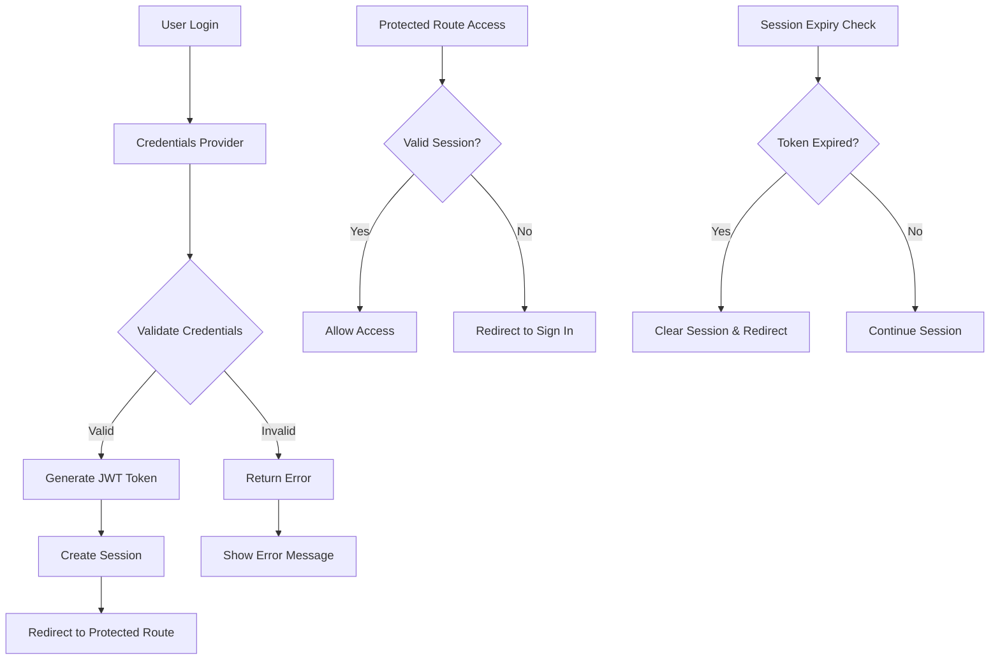

# Authentication System Documentation

## Overview

The authentication system is built with **NextAuth.js v4** and implements a custom credentials provider with JWT-based sessions. It supports user registration, login, password reset, and session management with configurable expiration times.

## Architecture

### Authentication Flow



## Core Components

### 1. NextAuth Configuration (`features/auth/nextauth/`)

#### **authOptions.ts**

Main NextAuth configuration with:

- JWT strategy for stateless sessions
- Custom credentials provider
- Redirect handling for seamless UX
- Session and JWT callbacks

```typescript
export const authOptions: NextAuthOptions = {
  session: { strategy: 'jwt' },
  providers: [credentialsProvider],
  callbacks: {
    jwt: jwtCallback,
    session: sessionCallback,
    redirect: ({ url, baseUrl }) => {
      // Custom redirect logic
    },
  },
  pages: { signIn: '/sign-in' },
};
```

#### **providers.ts**

Custom credentials provider that:

- Authenticates against Strapi API
- Fetches user profile data
- Handles "remember me" functionality
- Returns structured user object

#### **callbacks.ts**

Session and JWT callbacks for:

- Token enrichment with user data
- Session data transformation
- Login timestamp tracking

### 2. Middleware Protection (`middleware.ts`)

Implements route protection with:

- **Protected routes**: Require authentication
- **Auth routes**: Redirect authenticated users
- **Session expiry**: Automatic logout for expired sessions
- **Callback URL**: Preserves intended destination

```typescript
const protectedRoutes = [
  '/my-products',
  '/add-product',
  '/cart',
  '/checkout',
  '/order-history',
  '/my-wishlist',
  '/settings',
];

const authRoutes = [
  '/sign-in',
  '/sign-up',
  '/forgot-password',
  '/reset-password',
];
```

## Features

### 🔐 Session Management

#### **JWT Token Structure**

```typescript
interface JWT {
  id: number;
  accessToken: string;
  remember?: boolean;
  exp: number;
  maxAge: number;
}
```

#### **Session Expiration**

- **Default**: 4 hours
- **Remember Me**: 30 days
- **Automatic logout**: When token expires
- **Cleanup**: Session cookie removal

### 🛡️ Security Features

#### **Password Requirements**

- Minimum 8 characters
- Validated on both client and server
- Secure transmission over HTTPS

#### **CSRF Protection**

- Built-in NextAuth CSRF protection
- Token validation on all requests
- Automatic token rotation

#### **Route Protection**

- Middleware-based authentication
- Automatic redirects for unauthorized access
- Preserved callback URLs for seamless UX

## API Integration

### **Strapi Backend Communication**

#### **Login Endpoint**

```typescript
POST /api/auth/local
{
  "identifier": "user@example.com",
  "password": "userpassword",
  "remember": true
}
```

## Testing

### **Sign In Tests**

- Form validation (email format, password length)
- Successful login scenarios
- Error handling for invalid credentials
- Redirect behavior testing
- Remember me functionality

### **Test Coverage**

- Unit tests for hooks and components
- Integration tests for auth flow
- E2E tests for complete user journeys

## Configuration

### **Environment Variables**

```env
NEXTAUTH_SECRET=your-secret-key-here
NEXTAUTH_URL=http://localhost:3000
NEXT_PUBLIC_STRAPI_URL=your-strapi-api-url
SHOES_SHOP_BASE_API=your-api-base-url
```

### **NextAuth Pages**

Custom authentication pages are configured in `authOptions`:

```typescript
pages: {
  signIn: '/sign-in',
  // Add other custom pages as needed
}
```

## Security Considerations

1. **JWT Secret**: Use a strong, unique secret for production
2. **HTTPS**: Always use HTTPS in production
3. **Session Expiry**: Configure appropriate session timeouts
4. **Password Policy**: Enforce strong password requirements
5. **Rate Limiting**: Implement login attempt rate limiting
6. **CSRF Protection**: Enabled by default in NextAuth

## Troubleshooting

### **Common Issues**

1. **Session not persisting**: Check NEXTAUTH_SECRET and NEXTAUTH_URL
2. **Redirect loops**: Verify protected route configuration
3. **Token expiry**: Check maxAge settings in JWT callback
4. **API errors**: Verify Strapi endpoint URLs and authentication
5. **Localstorage errors**: Check for issues with corrupted localstorage data

## Future Enhancements

- **OAuth providers** (Google, GitHub, etc.)
- **Two-factor authentication**
- **Role-based access control**
- **Session management dashboard**
- **Account linking**
