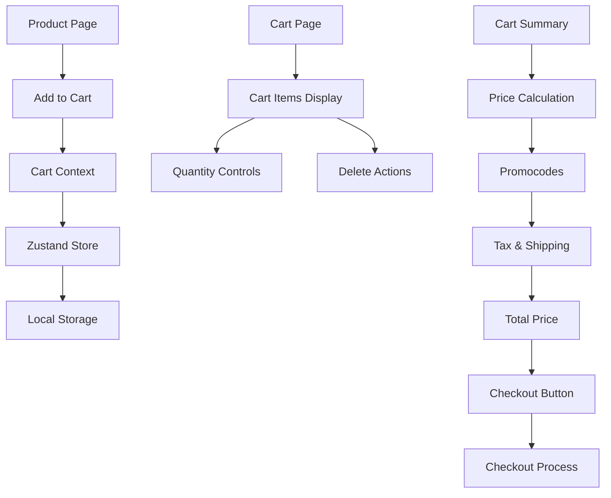
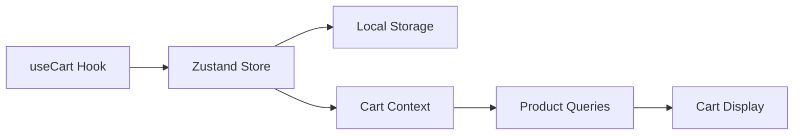

# Cart & Checkout System Documentation

## Overview

The cart and checkout system provides a comprehensive e-commerce experience with persistent cart state, real-time updates, promotional codes, and a multi-step checkout process. The system is built with TypeScript, Material-UI, and integrates seamlessly with the authentication system.

## Architecture

### 🛒 Cart System Flow

### 🔄 State Management

