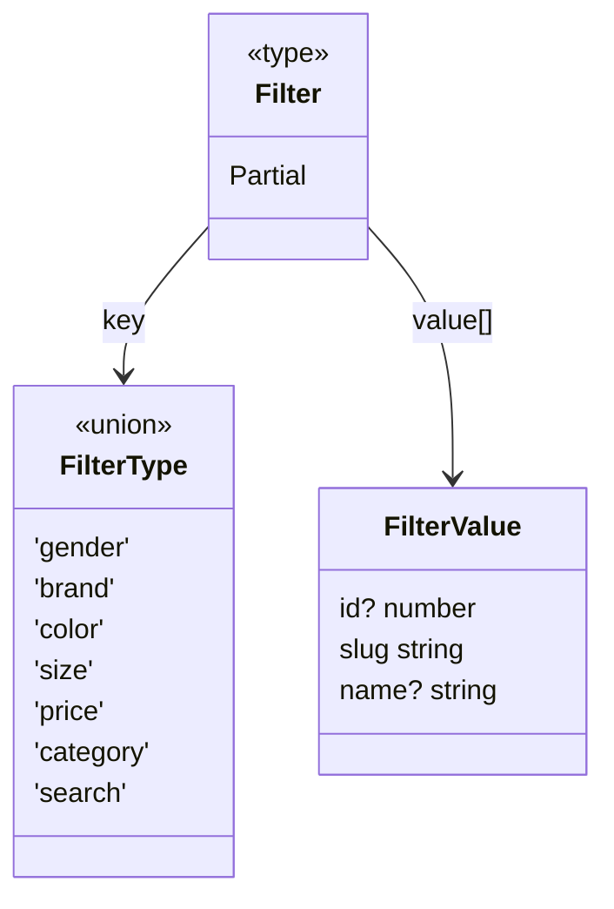

# Overview

Overview of filters.

## Filter representation



A **Filter** is a flexible structure that can hold multiple fields, each identified by a FilterType.
The available filter types are: search, price, gender, brand, color, size, category.

Each filter field stores a list of FilterValue objects shaped as:

```
{
  id?: number;
  slug: string;
  name?: string;
}
```

### Why these fields?

- **id** - used for querying Strapi efficiently (database lookups are fast with IDs).

- **slug** - used for representing filters in URLs. It is lowercase, whitespace-free, and convenient for comparing filters in a consistent way.

- **name** - used for displaying filter labels to users in a readable format.

So effectively, Filter is a Partial<Record<FilterType, FilterValue[]>>, meaning each filter type is optional, and if present, it maps to an array of filter values.

## Global Filter State with Zustand

This store manages all **applied filters** in a global state on the client side.  
It provides a consistent API for **adding, removing, toggling, resetting, and serializing filters** into a URL path.

---

### State Shape

- **`filters: Filter`** → the current set of active filters, where each key is a `FilterType` and the value is an array of `FilterValue`.

---

### Actions

- **`addFilterValue(type, value)`**  
  Adds a new filter value for the given type if it doesn’t already exist.

- **`removeFilterValue(type, value)`**  
  Removes a specific filter value by its `slug`.

- **`toggleFilterValue(type, value, maxSelections?)`**  
  Toggles a filter value on/off.
  - If `maxSelections` is set to `1`, it ensures only one active value per type.
  - If `maxSelections` > 1, it enforces a maximum number of selected values.

- **`setFilterValues(type, values)`**  
  Replaces all values for a specific filter type.

- **`setAllFilterValues(filter)`**  
  Replaces the entire filter state at once.

- **`applyFilters()`**  
  Serializes the active filters into a clean **URL path**.  
  Example:

  ```ts
  /products/gender:men/color:red-blue/brand:nike
  ```

## Filter Section Structure

The filter system was designed to be **semi-modular** in order to simplify code management and improve maintainability.  
The main idea is to reuse as much logic as possible across filter sections, while keeping flexibility for those with very different behaviors.

---

### Grouping

Filters were divided into two main groups based on their logic:

- **Group 1:** `Gender`, `Size`, `Brand`, `Color`, `Category`  
  (all share very similar logic for data fetching and state management)

- **Group 2:** `Price`  
  (requires a completely different approach)

---

### Shared Structure (Group 1)

All Group 1 filters are built inside the **`FilterSideBar`** and wrapped by reusable components:

- **`FilterSection`**
  - A wrapper with shared logic for Group 1.
  - Provides its own **context** to avoid prop drilling.
  - The context exposes:
    - `filterType`
    - `filterValues`
    - `areFiltersUsed`
    - `filterCountByValue`
    - `maxSelections`
  - Child components can consume these values directly without passing props down manually.

- **`FilterSectionDropdown`**  
  A wrapper that displays the section as a dropdown.

- **`FilterContainer`**  
  Two interchangeable components:
  - **Grid layout**
  - **List layout**  
    Both can be modularly injected into `FilterSection` via props.

- **`FilterItem`**  
  Two variants depending on the filter type:
  - **Tile component** for `Size`
  - **List item component** for the rest (Gender, Brand, Color, Category)

- **`SearchWrapper`**  
  A higher-order component (HOC) that:
  - Adds search logic
  - Limits the visible list to ~6 items
  - Provides its own **context**, consumed by child `CheckboxItem`s
  - If used outside its context, it falls back to values provided by the `FilterSection`.

---

### Special Case (Group 2)

- **`PriceFilterSection`**  
  Uses a **completely different logic** since price filtering cannot be handled in the same way as other filters.  
  It is always displayed as a **dropdown**.

---

### Why this structure?

- **Semi-modular** → avoids a fully fragmented design while still encouraging reuse.
- **DRY principle** → prevents code duplication across similar filters.
- **Context-driven** → eliminates prop drilling and makes components easier to plug and play.
- **Maintainability** → easier to extend or adjust logic per filter type without touching unrelated parts.
