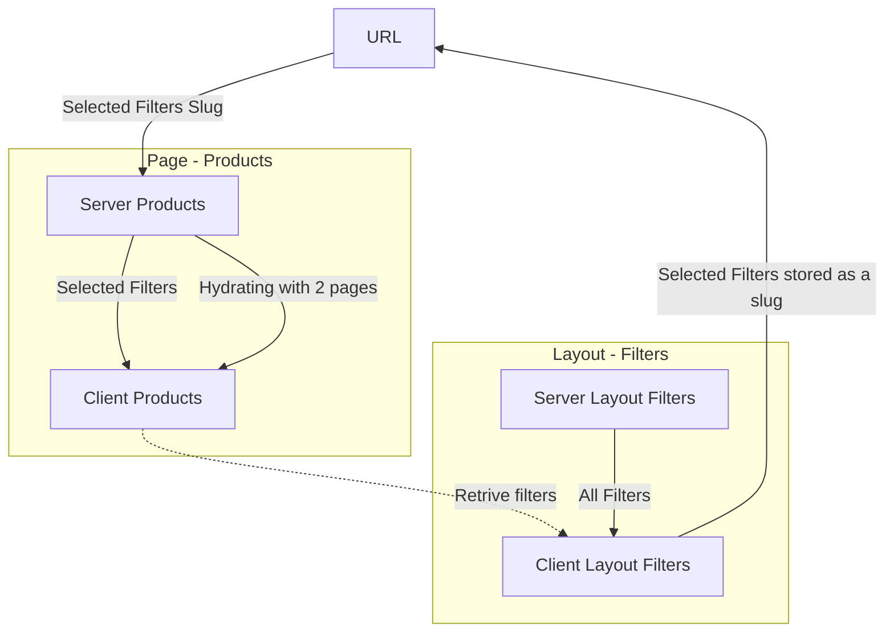
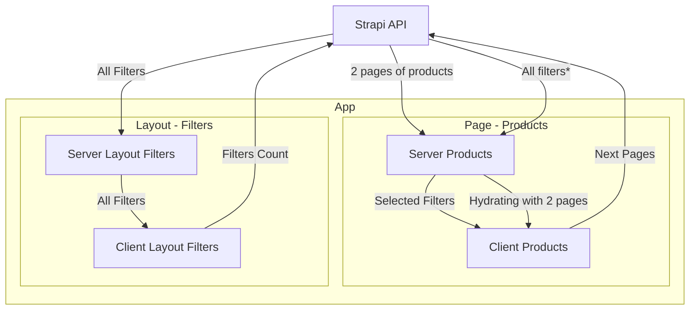
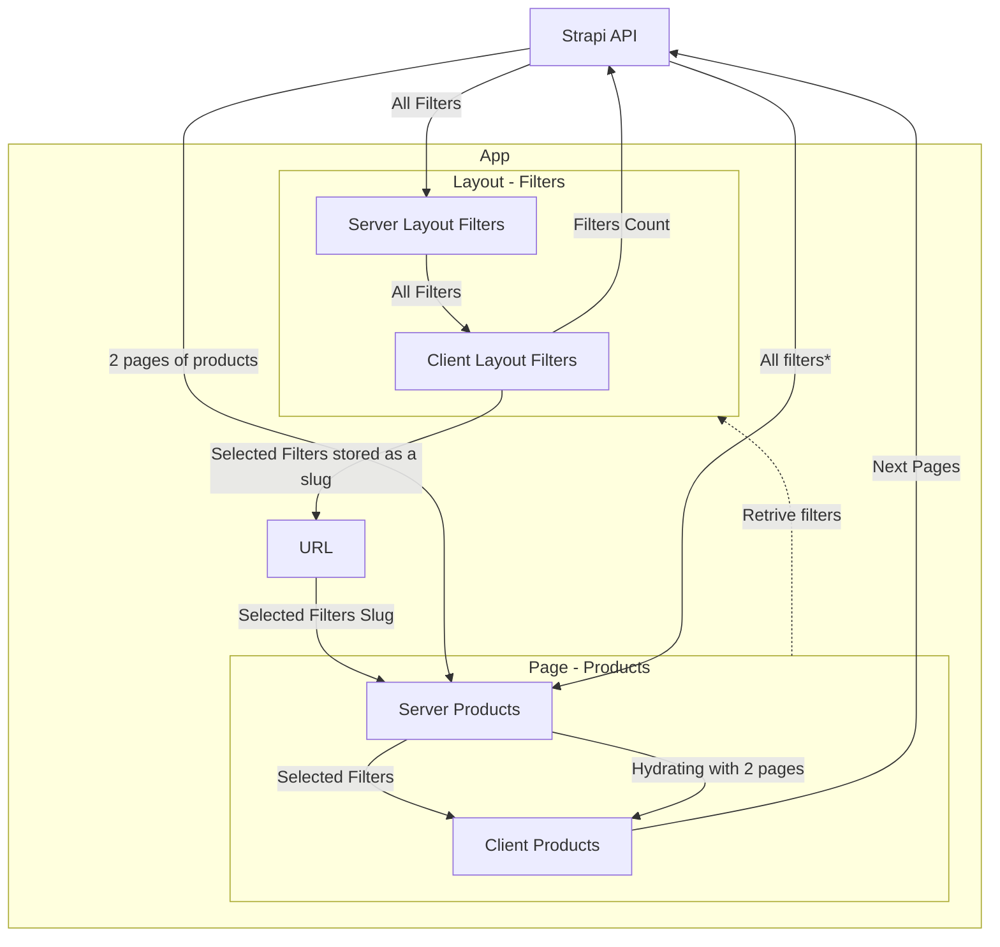

# Overview

Overview of products page and filters.

## Diagrams

When i put all relations on single chart it started to be unreadable. So i decided to split them into 3 diagrams:

- **Comunication between Filter module (layout) and Products module (Page)** (without comunication with strapi),
- **Coumunication between Modules and Strapi Api** (without coumnication with URL),
- all relations

### Diagram showing comunication Filter module (layout) - Products module (Page)

### Diagram showing comunication between Modules and Strapi Api

### Diagram showing all data flow

## Key Modules

### Server Layout Filters

- **What it does:**
  - Prefetches filters data from **Strapi API**.
  - Caches prefetched data and revalidates on demand when changes occur in Strapi.
- **Incoming data:**
  - All filters data from **Strapi API**.
- **Outgoing data:**
  - All filters data to **Client Layout Filters**.
- **Why:**
  - Users see filters instantly.
  - Improves SEO.
  - Reduces server computation load.

### Client Layout Filters

- **What it does:**
  - Provides interactive filter sections for users.
  - Shows how many products will be returned for each filter value.
  - Passes selected filters to the URL upon submission.
- **Incoming data:**
  - Selected filters data from **Server Layout Filters**.
- **Outgoing data:**
  - Filters data serialized as a slug to **URL**.
- **Why:**
  - Displays fresh filter counts.
  - Maintains the state of selected filters on refresh.
  - Passes selected filters to the products page via URL.

### Server Products Page

- **What it does:**
  - Caches pages with applied filters.
  - Prefetches all filters.
  - Prefetches the first 2 pages of products for given filters.
- **Incoming data:**
  - Filters slug from **URL**.
  - All filters data from **Strapi API**.
  - Products data from **Strapi API**.
- **Outgoing data:**
  - Filters data serialized as a slug to **URL**.
  - Selected filters data to **Client Layout Filters**.
- **Why:**
  - Displays products to users instantly.
  - Caches previously generated pages for ISR.
  - Improves SEO.

### Client Products Page

- **What it does:**
  - Presents products to users with infinite scrolling.
  - Fetches additional pages from **Strapi API** when users reach near the page bottom.
  - Retrieves filters from the URL after a browser refresh.
- **Incoming data:**
  - Selected filters data from **Server Products Page**.
  - Prefetched 2 pages of products data from **Server Products Page**.
- **Outgoing data:**
  - End of data flow (optionally in future: passes selected filters to Zustand for faster retrieval).
- **Why:**
  - Supports infinite scroll experience.

### URL

- **What it does:**
  - Stores filters data as a serialized slug (e.g., brands Red Wing and Nike saved as `/brand:red_wing-nike`).
- **Incoming data:**
  - Serialized selected filters.
- **Outgoing data:**
  - Serialized selected filters to **Products Page**.
  - Serialized selected filters to **Layout Filters**.
- **Why:**
  - Enables communication between **Products Page** and **Layout Filters**.
  - Retrieves used filters on browser refresh.
